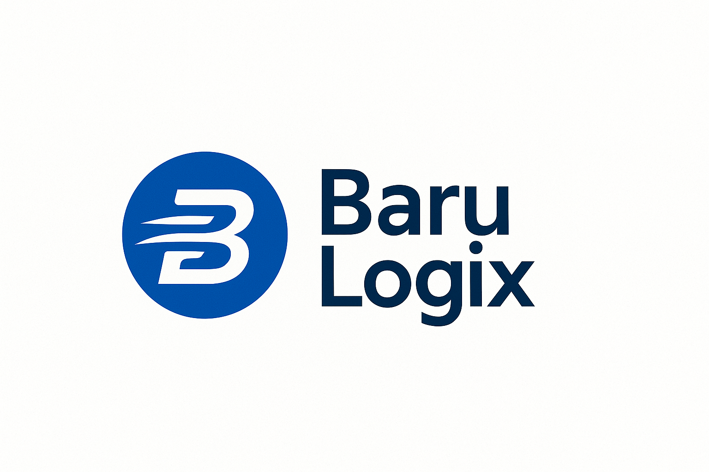

# 🚀 BaruLogix - Plataforma Logística Completa



## 📋 Descripción

BaruLogix es una plataforma logística completa y profesional que permite gestionar entregas, conductores, clientes y rutas de manera eficiente. Desarrollada con tecnologías modernas y diseño intuitivo.

## ✨ Características Principales

### 🎯 Funcionalidades Completas
- **📦 Gestión de Entregas** - Sistema completo de seguimiento con números de tracking
- **🚛 Administración de Conductores** - CRUD completo con información detallada
- **👥 Base de Datos de Clientes** - Información comercial y de contacto
- **📊 Dashboard Inteligente** - Estadísticas visuales y accesos rápidos
- **🔐 Autenticación Robusta** - Sistema seguro con verificación de email

### 🎨 Diseño Profesional
- **🖼️ Logo Oficial** integrado en toda la aplicación
- **📱 Responsive Design** optimizado para móviles y tablets
- **🎯 UX Anti-Dummies** con iconos intuitivos y mensajes claros
- **⚡ Animaciones Suaves** y transiciones elegantes
- **🎨 Paleta de Colores** profesional de la marca BaruLogix

### 🔒 Seguridad Avanzada
- **Row Level Security (RLS)** - Cada usuario ve solo sus datos
- **Políticas de Acceso** granulares por tabla
- **Validaciones Robustas** en frontend y backend
- **Manejo de Errores** específicos y amigables

## 🛠️ Tecnologías Utilizadas

- **Frontend:** Next.js 15, React, TypeScript, Tailwind CSS
- **Backend:** Next.js API Routes, Supabase
- **Base de Datos:** PostgreSQL (Supabase)
- **Autenticación:** Supabase Auth
- **Despliegue:** Vercel
- **Estilos:** Tailwind CSS con componentes personalizados

## 🚀 Despliegue Rápido

### 1. Clonar Repositorio
```bash
git clone https://github.com/BaruLogix/barulogix-production.git
cd barulogix-production
```

### 2. Instalar Dependencias
```bash
npm install
```

### 3. Configurar Variables de Entorno
Crea un archivo `.env.local` con:
```env
NEXT_PUBLIC_SUPABASE_URL=tu_supabase_url
NEXT_PUBLIC_SUPABASE_ANON_KEY=tu_supabase_anon_key
SUPABASE_SERVICE_ROLE_KEY=tu_service_role_key
NEXTAUTH_URL=http://localhost:3000
NEXTAUTH_SECRET=tu_nextauth_secret
```

### 4. Ejecutar en Desarrollo
```bash
npm run dev
```

### 5. Desplegar en Vercel
1. Conecta este repositorio a Vercel
2. Configura las variables de entorno
3. ¡Despliega!

## 📊 Estructura del Proyecto

```
barulogix-production/
├── src/
│   ├── app/                    # App Router de Next.js
│   │   ├── api/               # API Routes
│   │   │   ├── auth/          # Autenticación
│   │   │   ├── conductors/    # CRUD Conductores
│   │   │   ├── customers/     # CRUD Clientes
│   │   │   └── deliveries/    # CRUD Entregas
│   │   ├── auth/              # Páginas de autenticación
│   │   ├── dashboard/         # Dashboard principal
│   │   ├── conductors/        # Gestión de conductores
│   │   ├── customers/         # Gestión de clientes
│   │   └── deliveries/        # Gestión de entregas
│   └── lib/                   # Utilidades y configuración
├── public/                    # Archivos estáticos
└── docs/                      # Documentación
```

## 🗄️ Base de Datos

### Tablas Principales
- **conductors** - Información de conductores y vehículos
- **customers** - Base de datos de clientes
- **deliveries** - Sistema de entregas con seguimiento
- **delivery_history** - Historial de cambios de estado
- **user_profiles** - Perfiles de usuarios

### Configuración
Ejecuta el script SQL incluido en `/docs/schema.sql` para crear toda la estructura.

## 🔑 Credenciales por Defecto

### Administrador
- **Email:** barulogix.platform@gmail.com
- **Contraseña:** BaruAdmin2025!

## 📱 Funcionalidades por Módulo

### 🏠 Dashboard
- Estadísticas visuales en tiempo real
- Accesos rápidos a funciones principales
- Información del usuario y navegación

### 🚛 Conductores
- Registro completo con licencias y vehículos
- Estados: Activo, Inactivo, Suspendido
- Información de contacto y emergencia
- Gestión de salarios y comisiones

### 👥 Clientes
- Tipos: Regular, Premium, Corporativo
- Información comercial y fiscal
- Límites de crédito y términos de pago
- Historial de interacciones

### 📦 Entregas
- Números de tracking únicos
- Estados detallados del proceso
- Información completa del paquete
- Direcciones de recogida y entrega
- Gestión de costos y pagos

## 🔧 APIs Disponibles

### Autenticación
- `POST /api/auth/login` - Iniciar sesión
- `POST /api/auth/register` - Registrar usuario
- `POST /api/auth/resend-verification` - Reenviar verificación

### Conductores
- `GET /api/conductors` - Listar conductores
- `POST /api/conductors` - Crear conductor
- `PUT /api/conductors` - Actualizar conductor
- `DELETE /api/conductors` - Eliminar conductor

### Clientes
- `GET /api/customers` - Listar clientes
- `POST /api/customers` - Crear cliente
- `PUT /api/customers` - Actualizar cliente
- `DELETE /api/customers` - Eliminar cliente

### Entregas
- `GET /api/deliveries` - Listar entregas
- `POST /api/deliveries` - Crear entrega
- `PUT /api/deliveries` - Actualizar entrega
- `DELETE /api/deliveries` - Eliminar entrega

## 🎯 Características Técnicas

### Performance
- **Build optimizado** con Next.js 15
- **Imágenes optimizadas** con Next.js Image
- **Carga lazy** de componentes
- **Índices de base de datos** para consultas rápidas

### Seguridad
- **Row Level Security** habilitado
- **Validación de entrada** en todas las APIs
- **Sanitización de datos** automática
- **Políticas de acceso** granulares

### UX/UI
- **Diseño responsive** para todos los dispositivos
- **Iconos intuitivos** para cada acción
- **Estados visuales** claros
- **Mensajes de error** amigables
- **Confirmaciones** para acciones destructivas

## 📞 Soporte

Para soporte técnico o consultas:
- **Email:** barulogix.platform@gmail.com
- **Documentación:** Ver carpeta `/docs`

## 📄 Licencia

© 2025 BaruLogix. Todos los derechos reservados.

---

**🚀 BaruLogix - Llevando tu logística al siguiente nivel**

